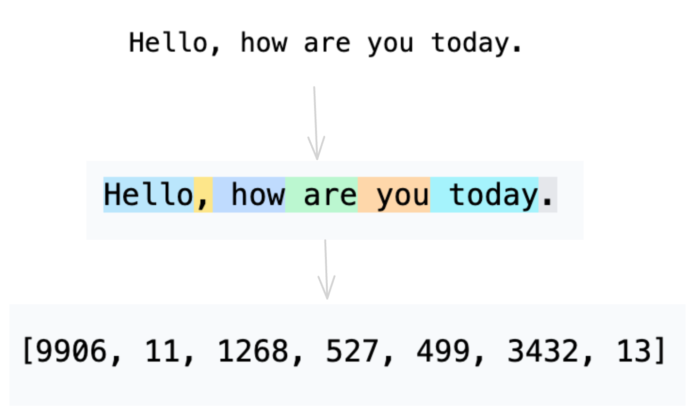

# LLM Tokenizer
the translator for LLM, consist of encode & decode functions.

# Resources : 

<ul>
  
<li> the original code : https://github.com/karpathy/minbpe/  </li>
<li>online try various tokenizer : https://tiktokenizer.vercel.app/  </li>
<li>BPE (Byte Pair Encoding) tokenizer tiktoken lib : https://github.com/openai/tiktoken/ </li>
<li>train your own tokenizer with https://github.com/google/sentencepiece/ </li>
<li> article about the problem of gpt4 tokenizer : https://www.lesswrong.com/posts/aPeJE8bSo6rAFoLqg/solidgoldmagikarp-plus-prompt-generation#  </li>

</ul>

# Licence : 
MIT
